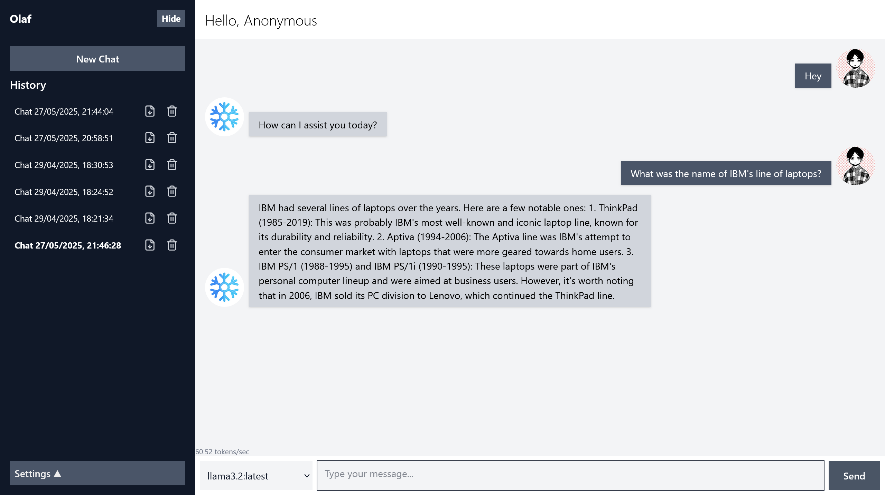
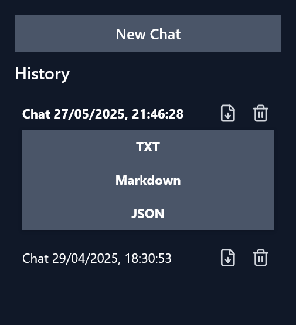

# Olaf ❄️ | Ollama Frontend

A local interface for interacting with Ollama through chat. Features include running multiple sessions, persistent history, chat export and theming. Built in React + TypeScript + Vite.

### Installation & Usage
- Clone this repo.
- `npm install`
- Start Ollama. By default, this app expects the Ollama API at http://localhost:11434.
- `npm run dev`
- Application will be live at localhost:5173.

### Features

- Set a custom username.
- Upload avatars for both the user and assistant (bot).
- Each chat session is saved in localStorage.
- Markdown rendering of replies.
- Sessions can be:
    - Deleted (individually or all at once).
    - Exported in .txt, .md, or .json formats.

Themes:

### Future Work

- Ability to search the web for live information.
