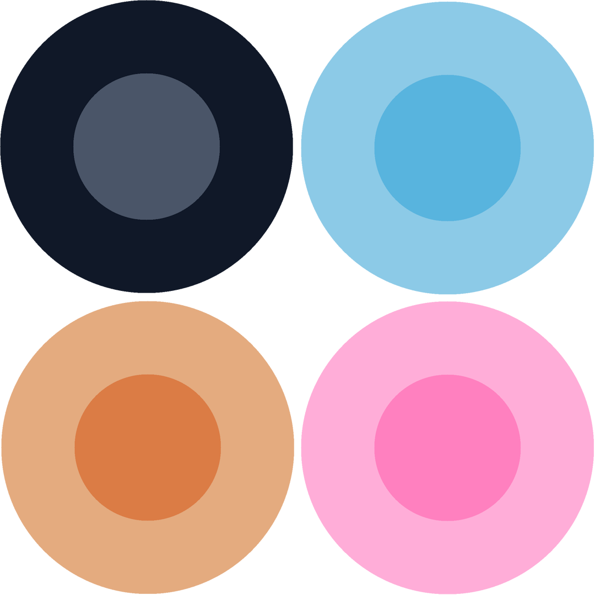

# Olaf ❄️

A GUI for interacting with Ollama through chat. Features include web search for up to date results, running multiple sessions, persistent history, chat export and theming. Built with React + TypeScript + Vite.

### Installation & Usage
- Clone this repo.
- `npm install`
- Start Ollama. By default, this app expects the Ollama API at http://localhost:11434.
- `npm run dev`
- Application will be live at localhost:5173.

### Features

- Web search
- Image generation API (Pollinations)
- Sessions can be:
    - Deleted (individually or all at once).
    - Exported in .txt, .md, or .json formats.
- Upload avatars for both the user and assistant (bot).
- Each chat session is saved in localStorage.
- Markdown rendering of replies.

Themes:

